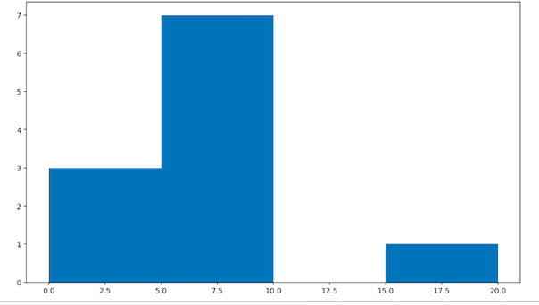
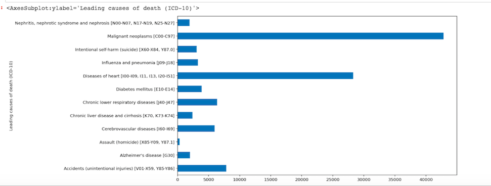

```python 
import matplotlib.pyplot as plt
values = [0,0,7,1,6.5,8.6,8.6,9.7,5.6,7.9,20]
plt.hist(values, bins=4)
plt.show()


```


```python
#read the csv file into dataframe
df = pd.read_csv("leading-cases-of-death.csv")

#remove all columns in the dataframe except for 'Leading causes of death (ICD-10)', 'REF_DATE', 'VALUE'
df1 = df[['Leading causes of death (ICD-10)', 'REF_DATE', 'VALUE']]

#remove every other year except for 2019
df1 = df[df.REF_DATE == 2019]

#use grouby() to group the dataframe by leading cause of death and sum the values
df_groupby = df1.groupby('Leading causes of death (ICD-10)')['VALUE'].sum()

#bar graph to show the result

df_groupby.plot(kind='barh')

```


