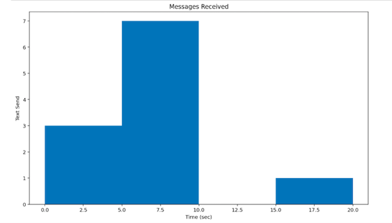

#### The example shows a basic histogram
```python 
import matplotlib.pyplot as plt
values = [0,0,7,1,6.5,8.6,8.6,9.7,5.6,7.9,20]
plt.hist(values, bins=4)
plt.show()

```


#### On this example I will add title, xlabel, and ylabel to the histogram from the first example
```python

import matplotlib.pyplot as plt
values = [0,0,7,1,6.5,8.6,8.6,9.7,5.6,7.9,20]
plt.hist(values, bins=4)
plt.xlabel('Time (sec)')
plt.ylabel('Text Send')
plt.title("Messages Received")
plt.show()

```


#### Here is another example of data manipulation and visualization. in the example, I will read a .csv file that shows the leading causes of death in men for all ages from 2015-2019.
#### My example will only show the bar graph for the year 2019.
```python
import matplotlib.pyplot as plt
import pandas as pd

#read the csv file into dataframe
df = pd.read_csv("leading-cases-of-death.csv")

#remove all columns in the dataframe except for 'Leading causes of death (ICD-10)', 'REF_DATE', 'VALUE'
df1 = df[['Leading causes of death (ICD-10)', 'REF_DATE', 'VALUE']]

#remove every other year except for 2019
df1 = df[df.REF_DATE == 2019]

#use grouby() to group the dataframe by leading cause of death and sum the values
df_groupby = df1.groupby('Leading causes of death (ICD-10)')['VALUE'].sum()

#bar graph to show the result

df_groupby.plot(kind='barh')

```


Date was downloaded from https://www150.statcan.gc.ca/t1/tbl1/en/tv.action?pid=1310039401