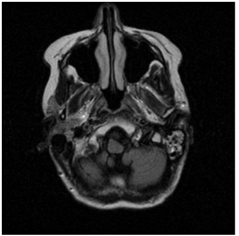

### Image Reading, Manipulation, Visualization and Masking

#### I started by loading the image into my code

```python
import imageio
import scipy.ndimage as ndi
import scipy.stats
import nibabel as nib
import numpy as np
import matplotlib.pyplot as plt

head_img = imageio.imread('MR-MONO2-16-head')

```
#### After loading my DICOM image, I read the metadata to make sure the image was read correctly
```python
print(head_img.meta)
```


#### I displayed the image and turned off the axes

```python
plt.imshow(head_img, cmap='gray')
plt.axis('off')
plt.show()
```


#### Plotted an histogram of the image to help identify the intensity ranges of different tissue types.

```python
hist = ndi.histogram(head_img, 0, 500, 500)
plt.plot(hist)
plt.show()
```


#### In this image, as we can see from the histogram above, white and grey matter have the same intensities, therefore we do not see distinct peaks in the histogram for each of these however, the histogram tells us that "brain" voxels generally have intensities between 150-200." So in order to distinguish between the brain tissue I will use a method call masking. I will change any intensity value greater than 100 to 1 otherwise 0.
```python 
head_mask = np.where(head_img > 100, 1, 0)
hist_mask = ndi.histogram(head_mask, 0, 500, 500)
plt.plot(hist_mask)
plt.show()
```


#### Now here is what our image looks like, we can now tell the difference between the grey matter and white matter voxels


#### Here is a plot of a histogram showing only the voxels inside the brain mask.


#### The DICOM file used in this code was downloaded from https://barre.dev/medical/samples/